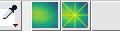
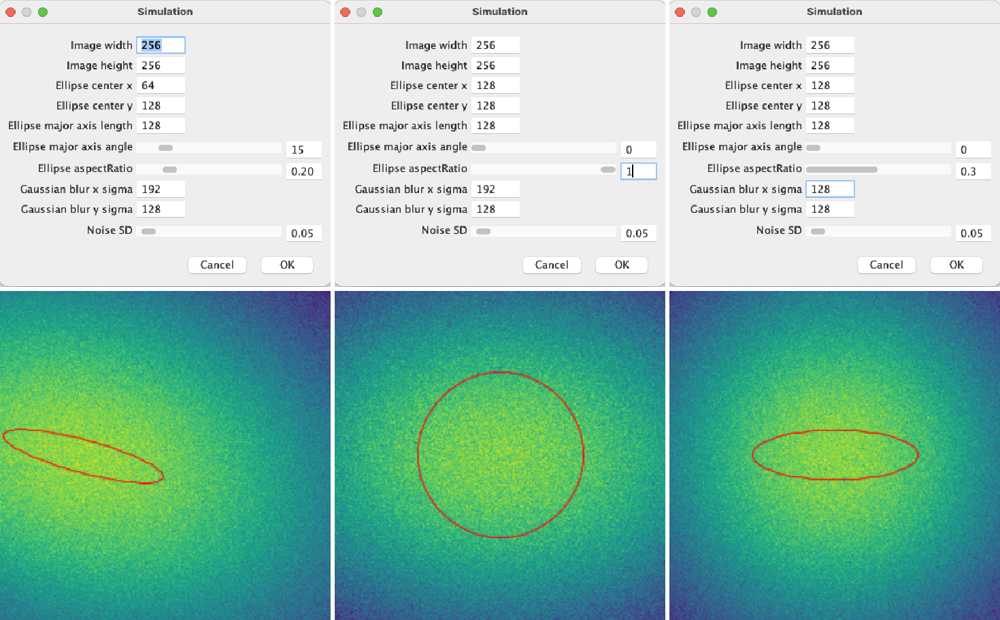
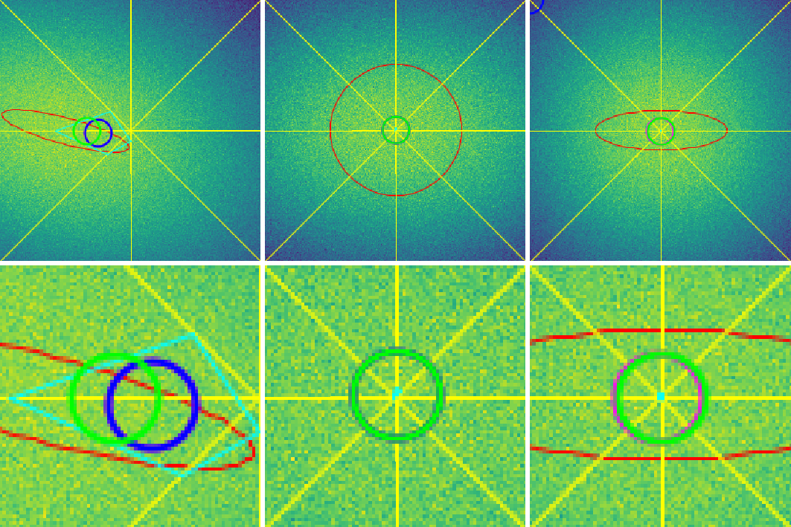

# Field Homogeneity ToolSet

## User's request

The MetroloJ plugin provides information about the field illumination that seem hard to interpret. Which data to keep/track is still a questions that require some exploration. The metric provided by the plugin might not be the most appropriate, especially on noisy images or when hot spots are present. In order to explore metrics, a toolset needs to be written.

## What does it do ?

The toolset is composed of two parts: a macro dedicated to generating simulated images, a second macro to retrieve some metrics.

### Simulation Tool

This tools is aimed at generating simulated images of uneven illumination.

1. Click on the Simulation button
2. The graphical user interface will require several information to generate the image:
    - Image width/height: self-explanatory
    - Ellipse center x/y, major axis length, angle, aspect ratio: an ellipse with the input features will be filled white to simulate the raw illumination spot
    - Use a rectangle instead of ellipse: self-explanatory
    - Gaussian blur x/y: a gaussian blur is used to simulate the PSF
    - Noise SD: gaussian noise is added to simulation, using the input as SD. NB: the simulations are generated as 32-bit images, the raw illumination spot having an intensity of 255
3. A new "Simulation" entitled image is generated as follows:
    - A blank image generated, filled with an intensity of 0
    - An ellipse is drawn according the the input parameters
4. In order to apply the gaussian blur onto the tilted ellipse, the image is rotated so that its major and minor axis both fit with horizontal and vertical axis 
5. A 3D gaussian blur is applied: this option is selected over regular gaussian blur option as it allows the sigma value to be different for x and y 
6. The image is rotated back to its original orientation and cropped to its original dimensions
7. The image intensities are normalized so that its maximum equals 1
8. Gaussian noise is added and the mpl-viridis LUT is activated
8. Finally, all the parameters used for simulation are added to the info metadata field of the image (use Image/Show info to check these metadata)

__NB:__ the position of the raw illumination is displayed on the image as an overlay. To retrieve the corresponding ROI, use Image/Overlay/To ROI Manager.

___Examples of parameters/simulations___

### Analysis Tool

This tools performs analysis on the active window.

1. The macro performs the following analysis on 4 lines: horizontal, vertical lines running over the center of the image, and the two diagonals:
2. The intensity profile is retrieved
3. A gaussian fitting is performed
4. The FWHM, the position of the maximum and the quality of fitting (R2) are logged to a results table
5. The position of the maximum, expressed as a coordinate along the line profile is translated to the actual XY coordinates over the image
6. A polygon is created, linking the 4 retrieved centers: its area is logged to the results table. The percentage of the image area covered by the polygon is also logged
7. Within the polygon the coordinates of the following points are logged to the results table, and displayed over the image as a circle, one color per center type:
    - Geometrical center, magenta
    - Centre of mass, blue
    - Position of the maximum intensity pixel within the ROI, green

__NB:__ all ROIs are added to the ROI manager

___Examples of analysis results___

## How to use it ?
### Versions of the software used

Fiji, ImageJ 2.1.0/1.53q

### Additional required software

None

## How to install and use the macro/toolset ?
### Toolset ImageJ:
1. Update ImageJ : Help/update puis Ok.
2. Drag and drop the macro file you'll find [here](Toolset/Field_Homogeneity_Tool.ijm) into ImageJ's installation folder/Macros/Toolset.
3. Under ImageJ's toolbar, click on the last tool on the right side (two red arrows) and select the macro from the drop-down list.
4. Follow the instructions given under the "what does it do" section.

## History

#### Version 1: 08/04/22
- First release

#### Version 2: 21/04/22

- Second release
- Bug correction:
    - The calibration metadata were not taken into account. As a result, the centers' coordinates retrieved in the results table were expressed in units, instead of pixels and misplaced on the image. This bug is now corrected
- Enhancement: 
    - Added a checkbox to use a rectangular shape instead of an ellipse for simulations

#### Version 3: 21/04/22

- Third release
- Bug correction:
    - The calibration bug was still present for the positionning of the polygon: went for a more radical workaround by removing the image's calibration before analysis, storing it, then reapplying it afterwards.
